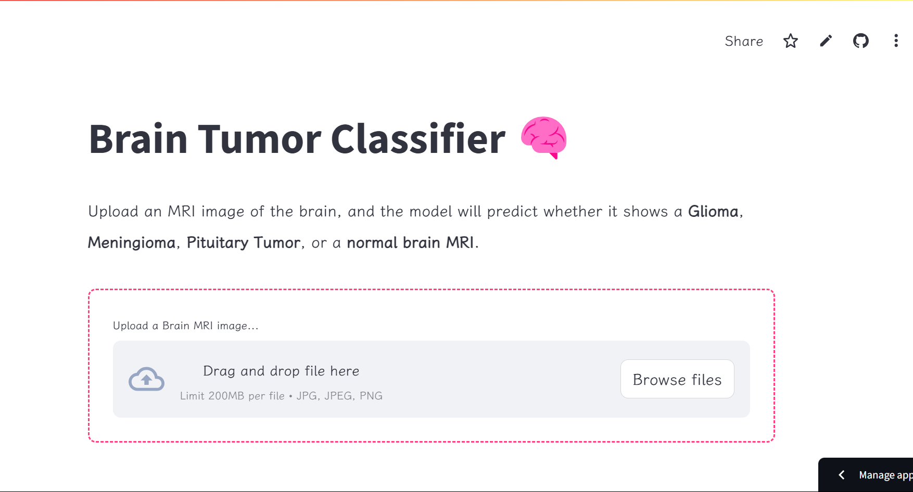

# Brain Tumor Classification using Deep Learning 🧠

Welcome to the **Brain Tumor Classification** project! This repository hosts a deep learning-based solution for classifying brain tumors from MRI images. The goal of this project is to leverage artificial intelligence to assist healthcare professionals in accurately diagnosing and categorizing brain tumors, ultimately improving patient outcomes.

This project is designed to be reproducible, scalable, and accessible, enabling you to run it locally or deploy it in the cloud. By automating the classification process, the aim is to reduce diagnostic time and improve the accuracy of tumor detection.

## 📝 **Problem Description**

Brain tumors are abnormal growths of tissue in the brain, which can be either benign (non-cancerous) or malignant (cancerous). Accurate detection of brain tumors is critical for effective treatment and improved patient outcomes. However, manual diagnosis of brain tumors from MRI scans is time-consuming and prone to human error.

### **Objective**

The primary objective of this project is to develop a **deep learning model** capable of classifying brain tumors into four categories:

1. **Glioma**
2. **Meningioma**
3. **Pituitary**
4. **No Tumor**

The model is trained on a curated dataset of MRI images and aims to provide a reliable, automated solution for tumor classification. This tool can assist radiologists and doctors in making faster thereby enhancing patient care.

## 📊 **Dataset**

The dataset used in this project consists of **7,023 labeled MRI images** of human brains, categorized into the four classes mentioned above. The dataset is sourced from **Kaggle** and **Figshare**, ensuring a diverse and comprehensive collection of brain MRI scans.

### Dataset Structure

- **Glioma**: Tumors originating from glial cells.
- **Meningioma**: Tumors arising from the meninges (protective layers of the brain).
- **Pituitary**: Tumors located in the pituitary gland.
- **No Tumor**: Healthy brain scans with no abnormalities.

For more details about the dataset and step on how to download it, refer to the [data folder](./data/README.md).

## 🎉 Live Streamlit App

You can check out the live version of the Streamlit app at the following URL:

[Streamlit App](https://tobai24-brain-tumor-classifi-deploymentweb-deploymentapp-xzi8bs.streamlit.app/)

### 📸 Screenshot of the App



## 🔧 **Tools & Technologies**

This project utilizes the following tools and technologies:

- **Deep Learning Framework**: PyTorch
- **Web Application Frameworks**:
  - **FastAPI** (for local deployment)
  - **Streamlit** (for cloud deployment)
- **Containerization**: Docker
- **Model Training & Evaluation**: Scikit-learn, Torchvision

## ✨ **Setup**

### **Prerequisites**

- Python 3.12
- Pip or Pipenv (for dependency management)
- Docker (for containerized deployment)

### **Local Setup**

#### 1. **Clone the Repository**

```bash
git clone https://github.com/Tobai24/Brain_tumor_classifier.git
cd Brain_tumor_classifier
```

#### 2. **Set Up the Python Environment**

**Option 1: Using `pipenv` (Recommended)**

- Install Pipenv:
  ```bash
  sudo apt install pipenv  # For Debian-based systems
  ```
  or
  ```bash
  pip install pipenv
  ```
- Install dependencies:
  ```bash
  pipenv install
  ```
- Activate the virtual environment:
  ```bash
  pipenv shell
  ```

**Option 2: Using `requirements.txt`**

- Create and activate a virtual environment:
  ```bash
  python -m venv venv
  source venv/bin/activate  # On Windows: venv\Scripts\activate
  ```
- Install dependencies:
  ```bash
  pip install -r requirements.txt
  ```

## 🚀 **Exploratory Data Analysis and Modeling**

The exploratory data analysis (EDA), data preprocessing, and model development are documented in the [notebook directory](./notebook/). Key files include:

- **`notebook.ipynb`**: A Jupyter notebook containing the EDA, data preprocessing, model training, and evaluation.
- **`models/`**: A folder containing the top 2 trained models saved as `.pth` files.
- **`performance/`**: A folder with CSV files detailing the performance metrics for each of the top models.
- **`train.py`**: A Python script for training the best-performing model. Run it using:
  ```bash
  python train.py
  ```

## 📁 **Deployment**

### **Local Deployment**

- **Tools**: FastAPI (for building the web app) and Docker (for containerization).
- **Location**: Navigate to the [deployment/fastapi](./deployment/fastapi) folder.
- **Instructions**: Follow the README in the folder to set up and run the app locally.

### **Cloud Deployment**

- **Tools**: Streamlit (for the web interface) and Streamlit Community Cloud (for hosting).
- **Location**: Navigate to the [deployment/web_deployment](./deployment/web_deployment) folder.
- **Instructions**: Follow the README in the folder to deploy the app on the cloud.

## 🎉 **Acknowledgments**

A special thanks to **[DataTalks.Club](https://datatalks.club)** for their free **Machine Learning Zoomcamp** course. The knowledge and skills gained from this course were instrumental in the development of this project. If you're interested in learning more about machine learning, I highly recommend checking out their [course](https://github.com/DataTalksClub/machine-learning-zoomcamp).
